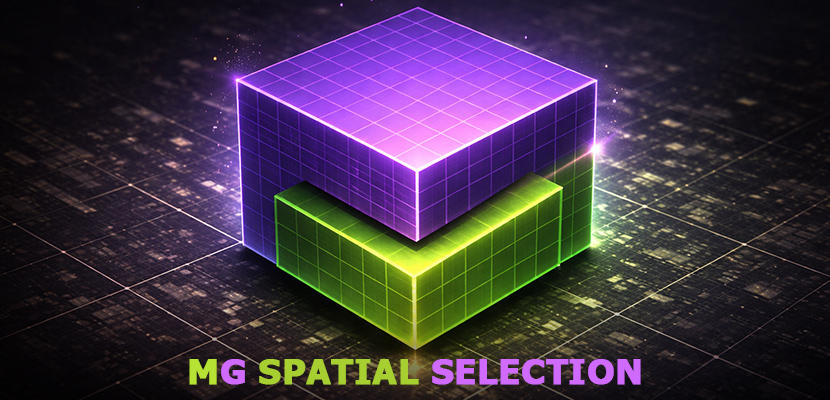
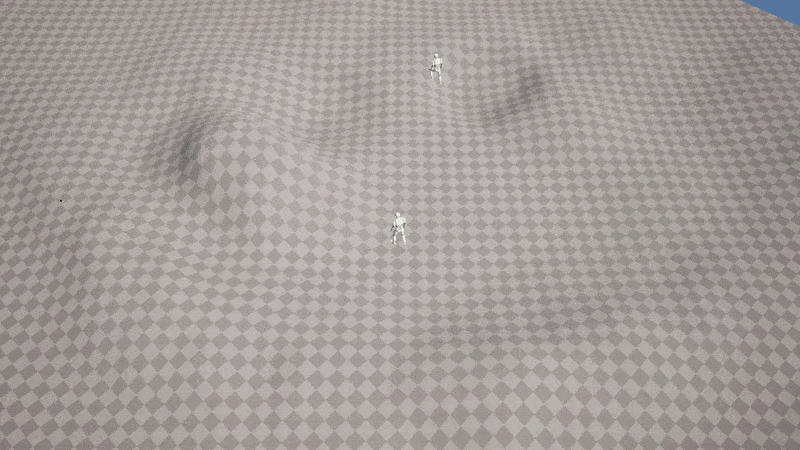
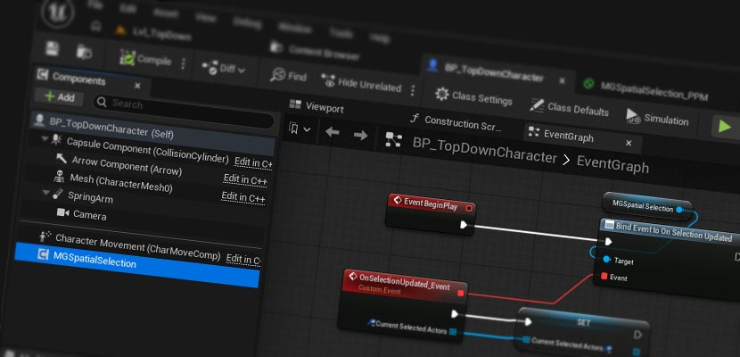
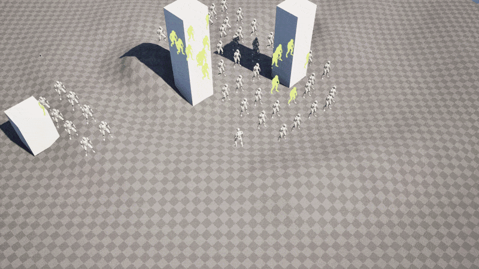
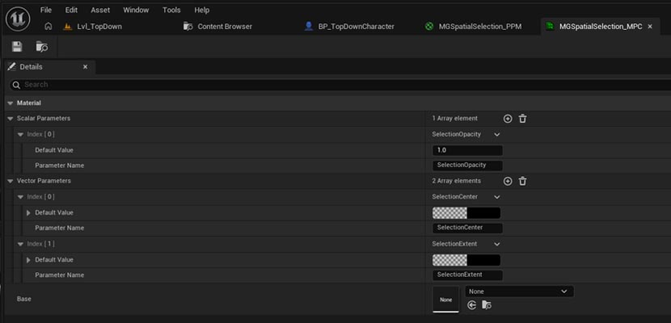
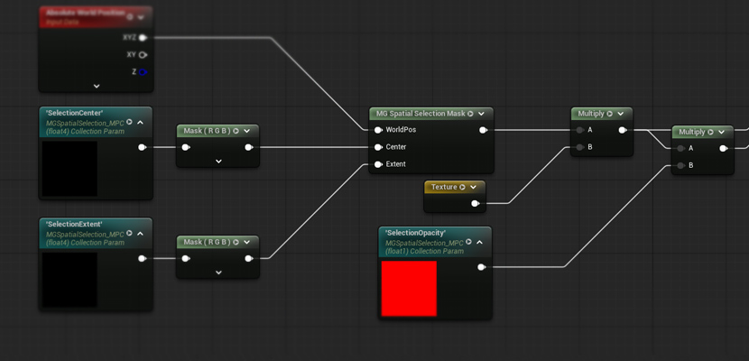
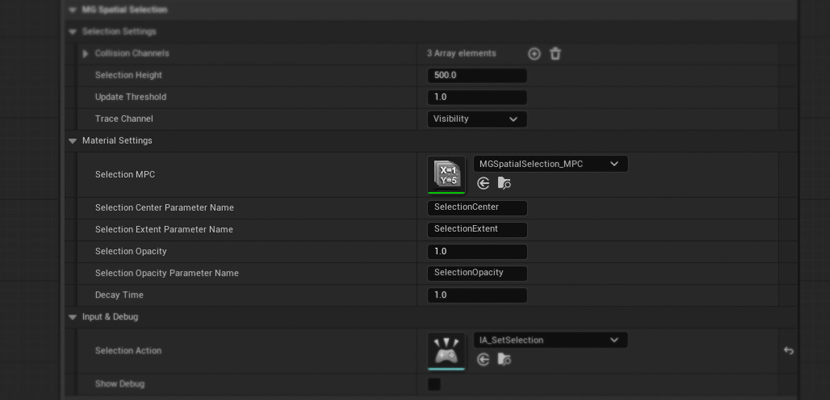
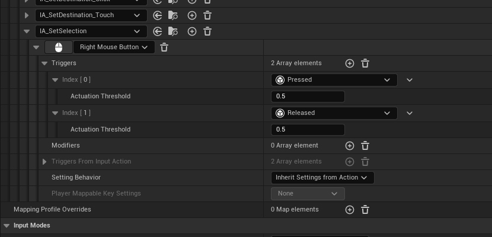

# MG Spatial Selection Plugin


[](https://github.com/cem-akkaya/MGSpatialSelection/releases)

[](https://gist.github.com/cheerfulstoic/d107229326a01ff0f333a1d3476e068d)



## Overview

MG Spatial Selection is an Unreal Engine plugin designed for high-performance, real-time spatial selection of actors within a volume.

Traditional RTS selection systems often rely on costly CPU raycasts or screen-space decals that struggle with complex geometry. **MG Spatial Selection** addresses these performance bottlenecks using a high-efficiency hybrid architecture:

- **CPU**: Optimized native box-overlap queries for actor detection.
- **GPU**: World-space mask rendering for pixel-perfect, terrain-aware visuals.

By moving the heavy lifting to the GPU and using Unreal's native collision for detection, the system avoids the overhead of massive raycast batches while ensuring the selection highlight perfectly conforms to any terrain.

The system is ideal for strategy games, editor tools, or any application requiring precise volume selection. It is fully integrated with Unreal's Material Editor through a custom C++ Material Expression (`MG Selection Mask`), providing a pixel-perfect, terrain-aware selection highlight that follows ground contours without any expensive CPU raycasts.

Integration is straightforward: attach the component to your character or player controller, define your collision channels, and implement the selection interface on any actor you wish to detect.

A demo with integrated plugin in action can be found below a link.
[MG Spatial Selection Demo UE5 Project](https://github.com/cem-akkaya/MGSpatialSelectionDemo)

If you have any bug or crash, please open an issue in the GitHub repo.  
If you have suggestions, questions or need help, you can always contact [me](https://github.com/cem-akkaya)

If you want to contribute, feel free to create a pull request.

---

## Features


- **High-Performance Selection**: Uses native `UBoxComponent` for efficient overlap detection using Unreal's collision system.
- **Dynamic Terrain-Aware Mask**: A custom C++ Material Expression (`MG Selection Mask`) provides a 3D box mask in shaders, allowing for high-performance visuals that perfectly follow terrain and geometry.
- **Material Parameter Collection (MPC) Integration**: Automatically pushes selection bounds (Center, Extent, Opacity) to a configurable MPC for real-time shader interaction.
- **Post-Selection Decay**: Supports a smooth "fade-out" effect (`DecayTime`) where the selection opacity gradually transitions to zero after the interaction is complete.
- **Stability and Performance**: Includes multi-stage stabilization (coordinate rounding, movement thresholds, and smoothed edge gradients) to eliminate visual flickering in early post-process passes.
- **Enhanced Input Integration**: Ready-to-use with Unreal Engine's Enhanced Input system.
- **Interface-Driven Interaction**: Easily filter selectable actors using the `IMGSpatialSelectionInterface`.
- **Batch Processing**: Smart event broadcasting ensures singular updates per frame even with complex overlaps.
- **Configurable Settings**: Full control over selection height, collision channels, and material parameter names.

---

## Installation



1. **Download and Place**: Place the `MGSpatialSelection` folder under your project's `Plugins/` directory.
2. **Activate Plugin**: Restart the editor and ensure the **MG Spatial Selection** plugin is enabled in the Plugins window.
3. **Add Component**: Add the `MGSpatialSelectionComponent` to your `PlayerController` or `Character`.
4. **Configure Input**: 
   - Assign a **Selection Action** (Enhanced Input) in the component settings.
   - Bind your input logic to call `StartSelection()` (Pressed) and `FinishSelection()` (Released) on the component. The system handles the update logic internally during the selection state, so you don't need to call any functions on Tick.
5. **Implement Interface**: Add the `IMGSpatialSelectionInterface` to any Actor classes you want to be selectable.
6. **Set Up Materials**: Use the provided `MGSpatialSelection_PPM` post-process material or create your own using the `MG Selection Mask` node.

---


## Detailed Integration Guide

### 1. The Material System
The plugin includes a ready-to-use Material Parameter Collection (MPC) and a Post-Process Material to get you started immediately.


- **Default MPC**: `/MGSpatialSelection/MGSpatialSelection_MPC`
  - This MPC is automatically assigned to the component.
  - It contains parameters for `SelectionCenter`, `SelectionExtent`, and `SelectionOpacity`.
- **Sample Material**: `/MGSpatialSelection/MGSpatialSelection_PPM`
  - A pre-configured Post-Process Material that uses the selection mask to highlight the terrain.
  - To use it, simply add it to a `PostProcessVolume`'s **Rendering Features > Post Process Materials** array.

### 2. The "MG Selection Mask" Material Node
Instead of building complex 3D math in the material editor, use the native C++ node:

1. Search for **MG Selection Mask** in the Material Editor.
g2. **Inputs**:
   - `WorldPos`: Connect to **Absolute World Position** (Recommended: Check "Exclude Material Shader Offsets" on the position node to prevent TAA jitter).
   - `Center`: Connect to a `CollectionParameter` node referencing `SelectionCenter` from the MPC.
   - `Extent`: Connect to a `CollectionParameter` node referencing `SelectionExtent` from the MPC.
3. **Outputs**: A 0-1 mask (with slight edge softening) that is `1` inside the selection volume and `0` outside.

### 3. Designer Settings
The `UMGSpatialSelectionComponent` provides several categories for customization:


#### **Selection Settings**
- `CollisionChannels`: The physics channels to overlap for actor detection (e.g., Pawn, PhysicsBody).
- `SelectionHeight`: The fixed Z-height of the selection volume.
- `TraceChannel`: The channel used for the ground hit (cursor deprojection).

#### **Material Settings**
- `SelectionMPC`: The Material Parameter Collection to update.
- `SelectionCenterParameterName` / `SelectionExtentParameterName`: Custom string names for the MPC variables.
- `SelectionOpacity`: The baseline intensity of the selection effect.
- `DecayTime`: How many seconds it takes for the highlight to fade to zero after the selection is released.

#### **Input & Debug**


- `SelectionAction`: The Enhanced Input Action that triggers the selection. Note: You only need to bind `StartSelection` to the **Started** event and `FinishSelection` to the **Completed/Canceled** events. The component handles its own internal updates.
- `bShowDebug`: Toggle to visualize the physical `UBoxComponent` in the world.
- `UpdateThreshold`: Movement threshold (in units) to filter out micro-jitter from MPC updates.

---
## Architecture / Flow
```text
  (CPU Logic)                                                                (GPU Rendering)
  [Input] ──► [Selection Component] ──► [Overlap Detection] ──► [Interface Dispatch] ──► [MPC] ──► [Post Process] ──► [Selection Mask]
```

## FAQ

<details>
<summary><b>Why use a Post-Process Material instead of Decals?</b></summary>

While Decals are great, a Post-Process Material using the `MG Selection Mask` is more performant when selecting massive areas or many units. It allows for "Tactical Overlay" effects like grid lines, scanlines, or pulse effects that are perfectly pixel-consistent across the whole screen.
</details>

<details>
<summary><b>Does it support slanted terrain?</b></summary>

Yes. Because the system uses the 3D depth buffer (via World Position) to calculate the mask, the selection highlight will perfectly wrap around hills, mountains, and even vertical walls.
</details>

<details>
<summary><b>How do I change the highlight color?</b></summary>

Open the `MGSpatialSelection_PPM` material in the plugin's Content folder and change the color tint in the material graph.
</details>

---

## License
This plugin is under MIT license.
MIT License does allow commercial use. You can use, modify, and distribute the software in a commercial product without any restrictions.

However, you must include the original copyright notice and disclaimers.

---

## Support Me

If you like the plugin, you can support my work here:

<a href="https://www.buymeacoffee.com/akkayaceq" target="_blank">

</a>
